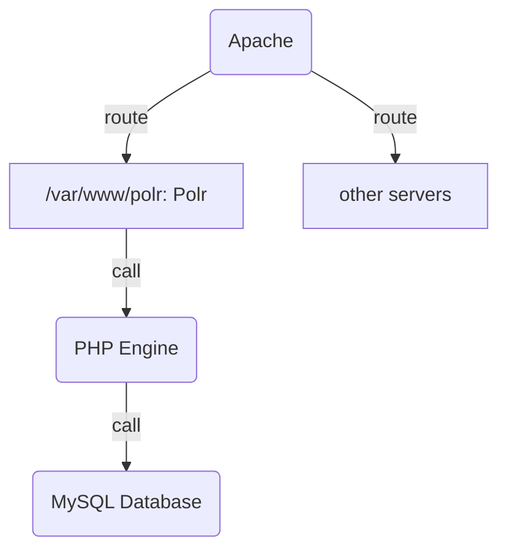

# 意达个人博客的搭建笔记

> 博客之搭建，前人之述备矣；春节之适暇，今人之道是举。


## 搭建博客用到的资源：
主要参考了[这篇文章](https://blog.csdn.net/sinat_37781304/article/details/82729029)，不过和文章中有所不同的是，首先我使用了[ayer](https://github.com/Shen-Yu/hexo-theme-ayer)这个主题。关于主题和博客的设置，可以参考[官方模板博客的设置](https://gitee.com/shen-yu/shen-yu/tree/dev/source)，也可以参考[我的设置](https://github.com/DF-Master/yidablog)。

- [vim的改良1](https://linuxhint.com/configure_vim_vimrc/)；[vim的改良2](https://blog.csdn.net/qq_37934101/article/details/80287879)；[vim的粘贴改良](http://xstarcd.github.io/wiki/vim/vim-copy-paste.html)

- [网页token素材库](www.iconfinder.com)

- [gitee图床的搭建](https://www.jianshu.com/p/a1e2cf01e05f)(这里我也尝试了Github图床，发现速度着实不够理想)

- [winscp访问root文件夹失败的解决办法](https://www.geek-share.com/detail/2763305440.html)

- [二维码美化](https://mh.cli.im/)

- [使用github对博客进行版本管理](https://blog.techbridge.cc/2018/01/17/learning-programming-and-coding-with-python-git-and-github-tutorial/)

- [使用Gitee对博客进行版本管理](https://blog.csdn.net/weixin_41010198/article/details/109166815)（国内比较快）

- [使用root权限](https://blog.csdn.net/qq_43178138/article/details/110100872)登录服务器（针对我的腾讯云服务器）

## 个人笔记

### 持续运行Hexo

[持续运行hexo](http://wiki.lonelyor.org/15655136450838.html)需要forever模块，我的代码如下：

```js
var spawn = require('child_process').spawn;
free = spawn('hexo', ['server', '-p 4000']);/*其实就是等于执行hexo server -p 4000*/
free.stdout.on('data', function (data) {
	console.log('standard output:\n' + data);
});
free.stderr.on('data', function (data) { 
	console.log('standard error output:\n' + data);
});
free.on('exit', function (code, signal) {
	console.log('child process eixt ,exit:' + code);
});

```

### 使用简写来简化命令

因为我使用的是zsh，所以在~/.zshrc中用alias修改简写命令。注意“=”前后不能加空格。

```sh
alias ll="ls -lha"
# 快速浏览文件

alias hc="hexo clean"
alias hg='hexo g'                          
alias hs='hexo server'
alias hcgs='hexo clean && hexo g && hexo server'
# 快速生成服务器

alias hcgd='hexo clean && hexo g && hexo d'
# 快速部署到github
```

设置完毕后，在root目录下来激活新命令。

```shell
source .zshrc
```


# 附录
## 使用markdown绘制思维导图

如果无法预览，请copy到typora中，语言为mermaid。


## 定时进行Git pull

在此之前，请先设置与github的通信已改为ssh免密码通信。

使用[crontab](https://blog.gtwang.org/linux/linux-crontab-cron-job-tutorial-and-examples/)来定时进行命令。


首先打开crontab


```shell
 sudo crontab -e
```


然后增加以下内容，保存


```shell
*/10 * * * * cd yourposition && git pull
# 10 min进行一次git pull
* */10 * * * cd /root/yidablog/yidablog && hcgd
```


